# Intel Products Sentiment Analysis Project

## Overview

Our primary objective was to build a web scraper to fetch Amazon product reviews for Intel processors. The overall project involves scraping live review data, pre-processing and exploring this data, and applying various machine learning techniques to perform sentiment analysis and get insights on the performance of Intel processors.

## Team Details

- **Team Name:** Fractals
- **Members:** Aviral Srivastava, Garv Bhaskar, Dinesh Kumar
- **Institution:** Vellore Institute of Technology, Chennai
- **Faculty Mentor:** Dr. Harini Sriraman

## Access the Python Notebook here
- **Python Script:** [model.py](https://github.com/GarvBhaskar/Intel-Product-Sentiment-Analysis/blob/main/model.ipynb)

## Proposed Solution

Our solution integrates TF-IDF vectorization with Logistic Regression for baseline performance evaluation, leveraging Word2Vec embeddings initialized within an LSTM architecture for enhanced semantic understanding. We use NLTK for tokenization and cleaning, and TF-IDF for feature extraction. Logistic Regression is fine-tuned via GridSearchCV, and an LSTM model is trained in Keras with pretrained Word2Vec embeddings. Evaluation metrics include accuracy and visualizations like word clouds.

## Data Sources Used
Real-time reviews were collected from various e-commerce websites and social media platforms using web scraping tools like BeautifulSoup and Scrapy.

## Data Visualization
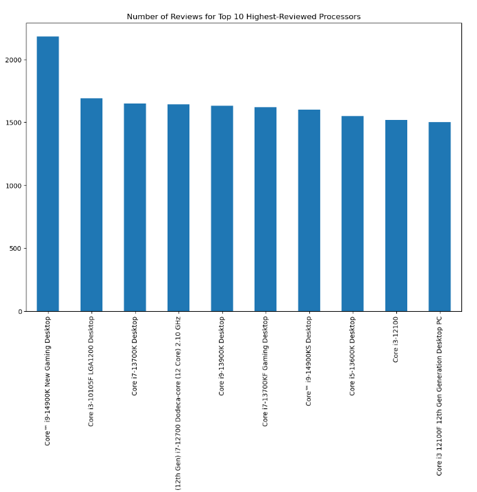 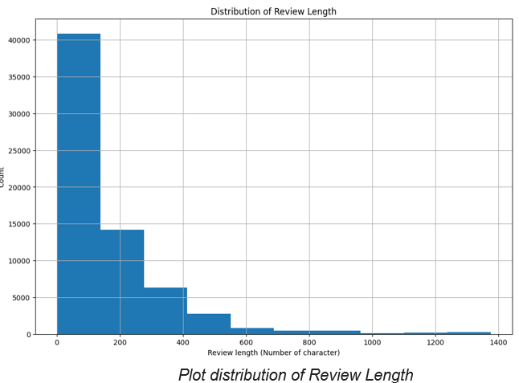
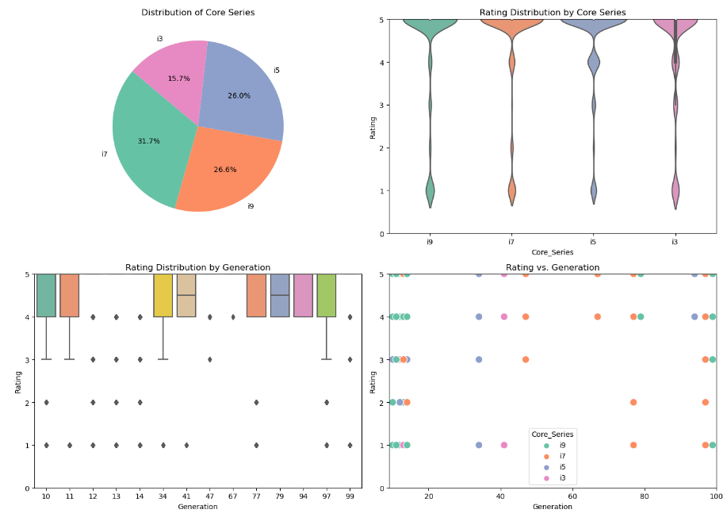 

## Data Preparation
Focused on cleansing and tokenizing textual reviews, addressing punctuation and stop words, and converting reviews into numerical formats suitable for models like Bag of Words and Word2Vec.

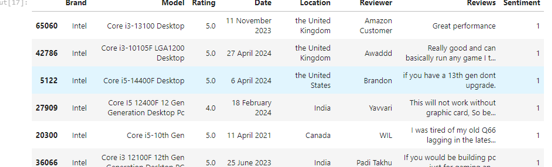

## Data Exploration
Analyzed sentiment label distribution for balance, visualized brand-specific rating distributions, and examined statistical summaries of review lengths.

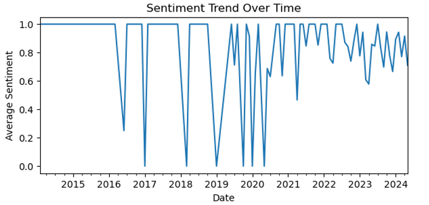 
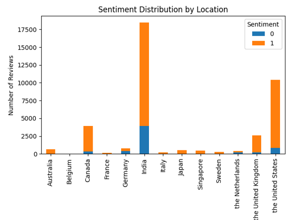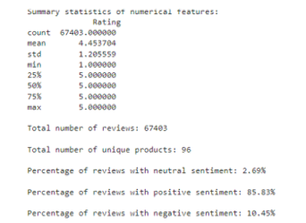

## Model Comparison
- **Benchmark Model:** CountVectorizer with Multinomial Naive Bayes
- **Other Models:** TfidfVectorizer with Logistic Regression, Pipeline and GridSearch
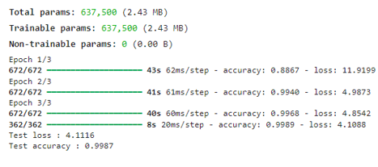

## LSTM with Word2Vec Embedding
1. Load pretrained word embedding model.
2. Construct embedding layer using embedding matrix as weights.
3. Train an LSTM with Word2Vec embedding (embedding layer => LSTM layer => dense layer).
4. Compile and fit the model using log loss function and ADAM optimizer.

## Word Clouds
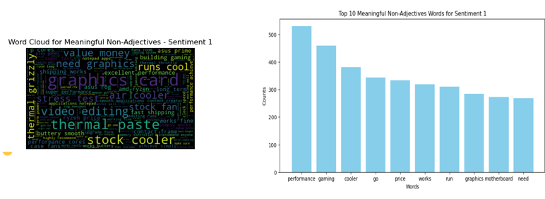 
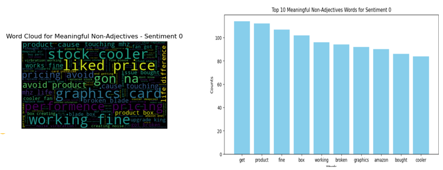

## Summary Generation
Generated summaries to capture key insights from the sentiment analysis results.
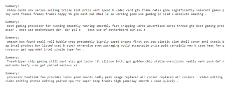

## Key Takeaways for Intel Engineers

### Positive Aspects:

1. **Performance and Efficiency:**
   - Intel processors are praised for their excellent performance in gaming, video editing, and other demanding applications.
   - The energy efficiency of Intel processors is particularly appreciated, especially during times of energy crisis.

2. **Customer Satisfaction:**
   - Users report high satisfaction with the smooth running and fast performance of Intel processors.
   - Many customers highlight the processors as the best choice for gaming and creative professionals.

3. **Features and Compatibility:**
   - Intel processors are valued for their compatibility with various motherboards and components.
   - Features like multiple cores and high GHz ratings are highly regarded.

4. **Customer Experience:**
   - Positive reviews often mention the enjoyable process of upgrading to Intel processors and the efficient performance once installed.

### Negative Aspects:

1. **Delivery and Packaging Issues:**
   - Some customers experienced poor packaging, with processors rattling around loose inside the box or inadequately protected by bubble wrap.
   - Instances of receiving used or B-stock products instead of new items have been reported.

2. **Quality Control:**
   - There are complaints about receiving defective or dysfunctional processors.
   - Customers have faced issues with processors not performing as expected, requiring multiple adjustments to settings.

3. **Performance Concerns:**
   - Overheating and the need to replace the stock heatsink fan with more efficient air coolers have been mentioned.

4. **Cost vs. Performance:**
   - Some customers feel the high price of Intel processors does not always match the performance gain, leading to buyer’s remorse.

---

